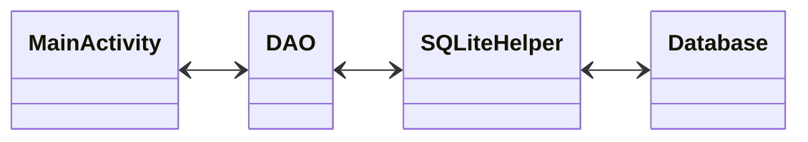

# Eine Einkaufsliste mit SQLite, ListView, Alert Dialog, Insert Update und Delete von Datensätzen

Dieses Projekt ist eine einfache Android-App, die es dem Benutzer ermöglicht, eine Einkaufsliste zu erstellen und zu verwalten. Die App verwendet die folgenden Technologien:

- SQLite: Eine relationale Datenbank, die auf dem Gerät des Benutzers gespeichert wird.
- ListView: Eine Ansicht, die eine Liste von Elementen darstellt und dem Benutzer ermöglicht, durch die Liste zu scrollen.
- Alert Dialog: Ein Dialogfenster, das es dem Benutzer ermöglicht einen Datensatz zu ändern.
- Die Datensätze können eingetragen, geändert und gelöscht werden. 
- Contextuel Actionbar: Eine Symbolleiste, die Kontextaktionen anzeigt, die auf die ausgewählten Elemente angewendet werden können.

## Funktionen

Die App verfügt über folgende Funktionen:

- Anzeigen der Einkaufsliste: Eine Liste von Einträgen wird angezeigt, die der Benutzer zuvor erstellt hat.
- Hinzufügen eines neuen Eintrags: Der Benutzer kann einen neuen Eintrag in die Liste einfügen.
- Bearbeiten eines vorhandenen Eintrags: Der Benutzer kann einen vorhandenen Eintrag bearbeiten.
- Löschen eines vorhandenen Eintrags: Der Benutzer kann einen vorhandenen Eintrag löschen, indem er auf den Eintrag in der Liste länger tippt und die Löschaktion aus dem Contextual Actionbar auswählt.

## Verwendung

Um das Projekt auszuführen, musst du Android Studio installiert haben. Folge dann diesen Schritten:

1. Lade das Projekt als ZIP-Datei herunter und entpacke es.
2. Öffne Android Studio und wähle "Open an existing Android Studio project" aus.
3. Navigiere zum entpackten Projektordner und wähle die build.gradle-Datei aus.
4. Warte, bis Android Studio das Projekt geöffnet und die Abhängigkeiten heruntergeladen hat.
5. Verbinde dein Android-Gerät mit deinem Computer und wähle es als Zielgerät aus.
6. Klicke auf "Run" (oder drücke Shift+F10), um das Projekt auf deinem Gerät auszuführen.

## Lizenz

Dieses Projekt wird unter der MIT-Lizenz veröffentlicht. Diese Lizenz gewährt jedem, der die Software erhalten hat, die Erlaubnis, sie frei zu verwenden, zu kopieren, zu ändern, zu veröffentlichen, zu verteilen, zu unterlizenzieren und/oder zu verkaufen, unter der Bedingung, dass der ursprüngliche Copyright-Vermerk und die Lizenzbestimmungen in allen Kopien oder wesentlichen Teilen der Software enthalten sind. Die Software wird ohne jegliche Garantie bereitgestellt und der Autor oder die Autoren sind in keinem Fall haftbar für Schäden oder andere Verpflichtungen im Zusammenhang mit der Software.

Wenn Sie die Software verwenden oder daran teilnehmen, erklären Sie sich damit einverstanden, die Bedingungen der MIT-Lizenz einzuhalten und auf Ihre eigene Verantwortung zu handeln.

Die Lizenz finden du am Ende dieser Datei.

# Was ist SQLite

SQLite ist eine relationale Datenbank, die auf Geräten und Systemen aller Art verwendet werden kann. Es ist eine leichte, plattformübergreifende und kostenlose Datenbank-Engine, die für ihre Geschwindigkeit, Portabilität und Skalierbarkeit bekannt ist. SQLite unterstützt SQL-Abfragen und Transaktionen und speichert Daten in einer Datei auf dem Gerät oder System. Es wird in einer Vielzahl von Anwendungen und Betriebssystemen eingesetzt, einschließlich mobiler Geräte, Desktop- und Webanwendungen sowie eingebetteter Systeme und IoT-Geräten. Aufgrund seiner Zuverlässigkeit und Flexibilität ist SQLite eine beliebte Wahl für Entwickler, die eine effektive und leistungsfähige Möglichkeit zur Speicherung und Verwaltung von Daten benötigen.

## Der SQLiteOpenHelper

Der SQLiteOpenHelper ist eine Android-Klasse, die verwendet wird, um eine Verbindung zur SQLite-Datenbank aufzubauen und die Erstellung, Aktualisierung und Öffnung der Datenbank zu verwalten. Der SQLiteOpenHelper vereinfacht die Verwendung von SQLite, indem er einen einfachen und standardisierten Ansatz für die Verwaltung von Datenbanken bietet.

Beim Verwenden des SQLiteOpenHelper gibt es einige bewährte Vorgehensweisen:

- Erweitere die Klasse SQLiteOpenHelper und überschreibe die Methoden onCreate(), onUpgrade() und onDowngrade().
- Implementiere die onCreate()-Methode, um die Datenbank bei der ersten Verwendung zu erstellen.
- Implementiere die onUpgrade()-Methode, um die Datenbank zu aktualisieren, wenn sich das Datenbankschema ändert.
- Implementiere die onDowngrade()-Methode, um die Datenbank auf eine frühere Version zurückzusetzen.
- Verwende eine Konstante, um die aktuelle Versionsnummer der Datenbank zu verfolgen.
- Verwende den SQLiteOpenHelper, um eine Instanz der Datenbankklasse zu erstellen und die Datenbankverbindung zu verwalten.
- Verwende die Methoden getReadableDatabase() und getWritableDatabase() des SQLiteOpenHelper, um eine lesende bzw. schreibende Verbindung zur Datenbank zu öffnen.
- Schließe die Datenbankverbindung, wenn sie nicht mehr benötigt wird.

Durch die Verwendung des SQLiteOpenHelper können Entwickler sicherstellen, dass ihre Datenbanken effektiv verwaltet und aktualisiert werden, um sicherzustellen, dass sie stets korrekt funktionieren und fehlerfrei arbeiten.

## Das Data Access Object(DAO)

Es ist sinnvoll, eine separate Klasse zu erstellen, um in der Datenbank zu arbeiten. Diese separate Klasse wird auch als Data Access Object (DAO) bezeichnet. Das DAO-Muster ist eine bewährte Methode, um den Zugriff auf die Datenbank in einer eigenen Schicht zu kapseln, um eine bessere Trennung von Geschäftslogik und Datenbankzugriff zu erreichen.

Durch die Implementierung eines DAOs wird die Codebasis leichter lesbar, wartbar und erweiterbar. Es ermöglicht auch eine einfachere Unit-Testing von Komponenten, da DAOs leicht austauschbar sind. Ein weiterer Vorteil ist, dass DAOs den Datenbankzugriff von der Benutzeroberfläche trennen, was zu einer klareren Trennung von Verantwortlichkeiten führt.

Insgesamt bietet die Verwendung einer separaten Klasse zur Datenbank-Interaktion eine effektive Möglichkeit, den Code zu organisieren und zu strukturieren, um eine höhere Codequalität und Wartbarkeit zu erreichen.

&copy; 2023 by Frank Neumann

## Lizenztext

Permission is hereby granted, free of charge, to any person obtaining a copy of this software and associated documentation files (the “Software”), to deal in the Software without restriction, including without limitation the rights to use, copy, modify, merge, publish, distribute, sublicense, and/or sell copies of the Software, and to permit persons to whom the Software is furnished to do so, subject to the following conditions:

The above copyright notice and this permission notice shall be included in all copies or substantial portions of the Software.

THE SOFTWARE IS PROVIDED “AS IS”, WITHOUT WARRANTY OF ANY KIND, EXPRESS OR IMPLIED, INCLUDING BUT NOT LIMITED TO THE WARRANTIES OF MERCHANTABILITY, FITNESS FOR A PARTICULAR PURPOSE AND NONINFRINGEMENT. IN NO EVENT SHALL THE AUTHORS OR COPYRIGHT HOLDERS BE LIABLE FOR ANY CLAIM, DAMAGES OR OTHER LIABILITY, WHETHER IN AN ACTION OF CONTRACT, TORT OR OTHERWISE, ARISING FROM, OUT OF OR IN CONNECTION WITH THE SOFTWARE OR THE USE OR OTHER DEALINGS IN THE SOFTWARE.

### Sinngemäße Übersetzung

Jedem, der eine Kopie dieser Software und der zugehörigen Dokumentationsdateien (die „Software“) erhält, wird hiermit kostenlos die Erlaubnis erteilt, ohne Einschränkung mit der Software zu handeln, einschließlich und ohne Einschränkung der Rechte zur Nutzung, zum Kopieren, Ändern, Zusammenführen, Veröffentlichen, Verteilen, Unterlizenzieren und/oder Verkaufen von Kopien der Software, und Personen, denen die Software zur Verfügung gestellt wird, dies unter den folgenden Bedingungen zu gestatten:

Der obige Urheberrechtshinweis und dieser Genehmigungshinweis müssen in allen Kopien oder wesentlichen Teilen der Software enthalten sein.

DIE SOFTWARE WIRD OHNE MÄNGELGEWÄHR UND OHNE JEGLICHE AUSDRÜCKLICHE ODER STILLSCHWEIGENDE GEWÄHRLEISTUNG, EINSCHLIEẞLICH, ABER NICHT BESCHRÄNKT AUF DIE GEWÄHRLEISTUNG DER MARKTGÄNGIGKEIT, DER EIGNUNG FÜR EINEN BESTIMMTEN ZWECK UND DER NICHTVERLETZUNG VON RECHTEN DRITTER, ZUR VERFÜGUNG GESTELLT. DIE AUTOREN ODER URHEBERRECHTSINHABER SIND IN KEINEM FALL HAFTBAR FÜR ANSPRÜCHE, SCHÄDEN ODER ANDERE VERPFLICHTUNGEN, OB IN EINER VERTRAGS- ODER HAFTUNGSKLAGE, EINER UNERLAUBTEN HANDLUNG ODER ANDERWEITIG, DIE SICH AUS ODER IN VERBINDUNG MIT DER SOFTWARE ODER DER NUTZUNG ODER ANDEREN GESCHÄFTEN MIT DER SOFTWARE ERGEBEN.